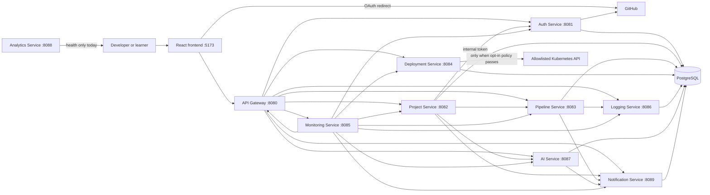
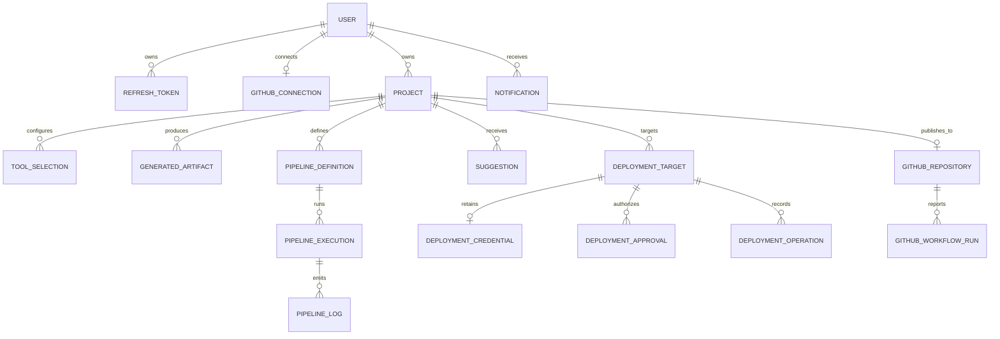
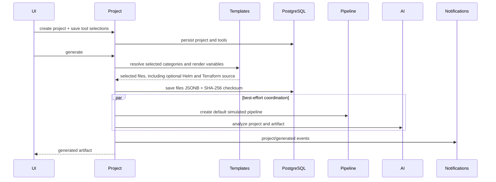
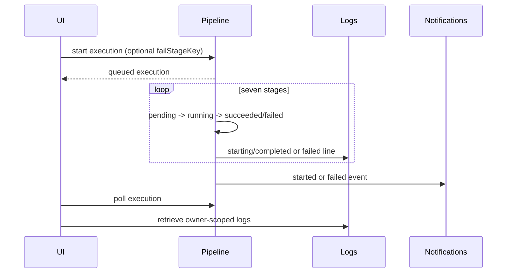
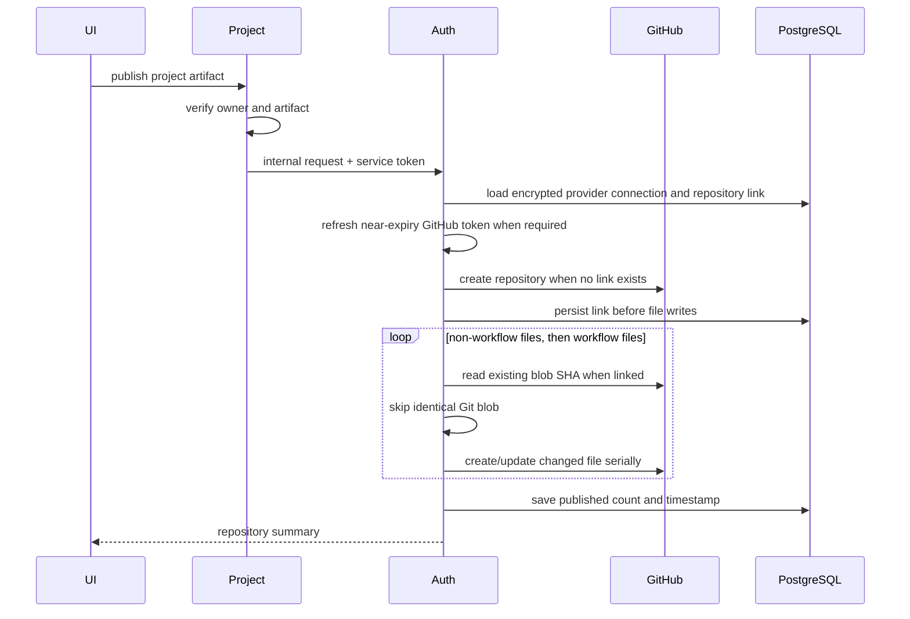
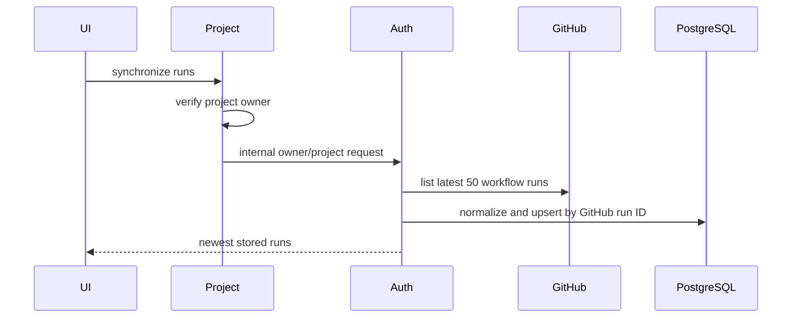
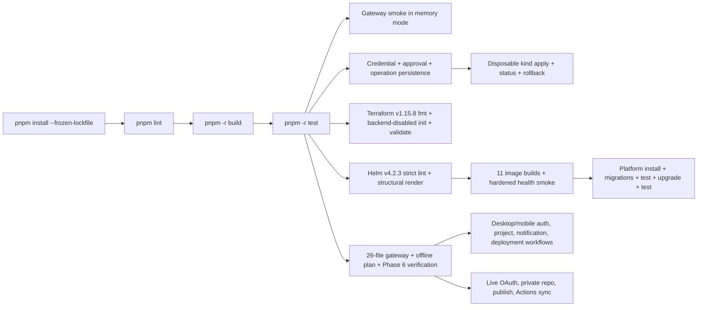

# BuildSphere Project Knowledge Graph

## Document information

| Field                  | Value                                                                                    |
| ---------------------- | ---------------------------------------------------------------------------------------- |
| Purpose                | Self-contained technical and product context for learning, presentation, and AI tutoring |
| Snapshot date          | 2026-07-14                                                                               |
| Current milestone      | Phase 10 complete; production images and the BuildSphere chart locally live-validated    |
| Intended readers       | Project owner, reviewers, interviewers, mentors, and ChatGPT                             |
| Structured companion   | `docs/project-knowledge-graph.json`                                                      |
| Presentation companion | `docs/16_PRESENTATION_AND_LEARNING_GUIDE.md`                                             |

## Safe sharing note

This document intentionally excludes `.env`, passwords, GitHub tokens, client
secrets, personal account data, and private repository identifiers. It can be
uploaded to an AI tutor without uploading the local secret-bearing `.env` file.

## One-sentence model

BuildSphere is a documentation-first, AI-assisted Developer Experience Platform
that guides a developer from project configuration to generated DevOps assets,
explainable pipeline simulation, recommendations, deployment validation,
optional Helm packaging, disabled-by-default AWS EKS Terraform generation,
secure Kubernetes connection inspection, offline planning, opt-in approved
apply, durable status and bounded rollback, plus optional real GitHub repository
and Actions integration. BuildSphere itself is packaged as non-root containers
and a hardened Helm release for controlled staging.

## What problem it solves

Modern delivery requires developers to connect source control, dependency
management, CI/CD, containers, Kubernetes, observability, security, and
documentation. BuildSphere gives learners and portfolio builders one guided
workspace that makes those connections visible instead of hiding them behind
automation.

BuildSphere is deliberately not a cloud provider, production Kubernetes control
plane, full CI runner, secret manager, or source-code hosting service.

## Truth labels

Use these labels throughout this graph:

- **Implemented**: present in executable source and covered by current tests or live verification.
- **Prepared**: folder, configuration, template, or interface exists, but it is not part of the active runtime workflow.
- **Future**: documented idea that must receive requirements and a backlog ticket before implementation.

## Current status

| Area                     | Status                                                     | Evidence                                                           |
| ------------------------ | ---------------------------------------------------------- | ------------------------------------------------------------------ |
| Roadmap Phases 1-5       | Implemented                                                | `docs/12_ROADMAP.md`, `docs/13_BACKLOG.md`                         |
| Phase 6 GitHub milestone | Implemented and live-validated                             | `specs/GITHUB_INTEGRATION_SPEC.md`, `memory/completed-features.md` |
| Phase 7 Helm generation  | Implemented and gateway-validated                          | `specs/HELM_SPEC.md`, `memory/completed-features.md`               |
| Phase 8 Terraform        | Implemented and statically validated                       | `specs/TERRAFORM_SPEC.md`, `memory/completed-features.md`          |
| Phase 9 Kubernetes       | Inspection, planning, apply, status, and rollback complete | `specs/DEPLOYMENT_SPEC.md`, ADR-010, ADR-011                       |
| Phase 10 packaging       | 11 images and platform Helm release locally live-validated | `specs/PRODUCTION_DEPLOYMENT_SPEC.md`, ADR-012                     |
| Automated verification   | 61 tests plus lint and production builds pass              | `docs/11_TESTING.md`, `memory/next-session.md`                     |
| PostgreSQL persistence   | Implemented and restart-tested                             | migrations and smoke scripts                                       |
| Browser workflow         | Auth, project, notification, and deployment flows checked  | `memory/completed-features.md`                                     |
| Real deployment          | Opt-in non-production Kubernetes workflow live-validated   | `scripts/verify-phase9-kind.ts`, `docs/11_TESTING.md`              |
| External LLM             | Future                                                     | local `rules` and `mock` modes only                                |

## System context graph



## Runtime component registry

| Component            | Port | Responsibility                                                                                                                                      | Important relationships                                                        | Current maturity              |
| -------------------- | ---: | --------------------------------------------------------------------------------------------------------------------------------------------------- | ------------------------------------------------------------------------------ | ----------------------------- |
| Frontend             | 5173 | Authentication, dashboard, project wizard with Helm/Terraform choices, file viewer, pipeline timeline, GitHub workspace, suggestions, deployment UI | Calls only API Gateway; redirects browser to GitHub for OAuth                  | Implemented                   |
| API Gateway          | 8080 | Public REST entry point, CORS, correlation propagation, route proxying                                                                              | Routes by path to domain services                                              | Implemented                   |
| Auth Service         | 8081 | Password auth, JWT sessions, refresh-token revocation, GitHub OAuth, provider tokens, repository publishing, Actions synchronization                | Calls GitHub; owns provider secret boundary                                    | Implemented                   |
| Project Service      | 8082 | Projects, dependency-checked tool selections, Helm/Terraform rendering, artifact bundles, TAR downloads, project-scoped GitHub endpoints            | Coordinates Pipeline and AI after generation; calls Auth internally for GitHub | Implemented                   |
| Pipeline Service     | 8083 | Explainable pipeline definitions, simulated executions, status transitions, cancellation                                                            | Writes logs through Logging Service and emits notifications                    | Implemented, simulated runner |
| Deployment Service   | 8084 | Targets, validation, inspection, plans, encrypted credentials, approved apply, status, and rollback                                                 | Reads owned artifacts; optionally calls exact allowlisted Kubernetes APIs      | Phase 9 implemented           |
| Monitoring Service   | 8085 | Aggregates eight service health endpoints and emits Prometheus text metrics                                                                         | Polls Gateway and seven domain services                                        | Implemented foundation        |
| Logging Service      | 8086 | Internal log ingestion and owner-scoped execution log retrieval                                                                                     | Receives simulated pipeline logs                                               | Implemented                   |
| AI Service           | 8087 | Rule-based or mock suggestions, prompt-file loading, suggestion status                                                                              | Reads project/artifact context; emits notifications                            | Implemented locally           |
| Analytics Service    | 8088 | Reserved product analytics boundary                                                                                                                 | No database or events yet                                                      | Health-only scaffold          |
| Notification Service | 8089 | Internal event creation, user-scoped listing, mark-as-read                                                                                          | Called by Project, Pipeline, AI, and Deployment services                       | Implemented                   |
| Shared Types         |  n/a | Cross-package TypeScript contracts                                                                                                                  | Used by frontend and domain services                                           | Implemented                   |
| Service Core         |  n/a | JWT, scrypt, errors, logging, PostgreSQL, migrations, notifications, graceful shutdown                                                              | Used by backend services                                                       | Implemented                   |

## Why each technology is used

| Technology             | Where it appears                                    | Why it was chosen                                     | How it helps this project                                                 | Status                                                 |
| ---------------------- | --------------------------------------------------- | ----------------------------------------------------- | ------------------------------------------------------------------------- | ------------------------------------------------------ |
| TypeScript             | Frontend, services, shared packages, scripts        | One typed language across the workspace               | Shared contracts catch integration mistakes during compilation            | Active                                                 |
| Node.js 22             | All TypeScript runtime services and scripts         | Mature async I/O and strong tooling                   | Runs many small HTTP services with one toolchain                          | Active                                                 |
| React 18               | Frontend                                            | Component model and broad ecosystem                   | Organizes the wizard, dashboards, tabs, and stateful workflows            | Active                                                 |
| Vite 5                 | Frontend dev/build                                  | Fast local server and simple production bundling      | Keeps the local feedback loop short                                       | Active                                                 |
| Express 4              | Gateway and services                                | Small, explicit REST framework                        | Makes routing, middleware, and service boundaries easy to inspect         | Active                                                 |
| Zod 3                  | Request validation                                  | Runtime data validation complements TypeScript        | Rejects malformed API input before business logic                         | Active                                                 |
| Pino 9                 | Backend logging                                     | Structured, low-overhead JSON logging                 | Adds service, correlation ID, status, and duration to requests            | Active                                                 |
| PostgreSQL 16          | Durable product state                               | Relational constraints, transactions, auditability    | Stores users, projects, runs, suggestions, targets, and events            | Active                                                 |
| `pg`                   | Service Core data access                            | Direct and transparent PostgreSQL driver              | Keeps SQL and ownership visible without an ORM                            | Active                                                 |
| PNPM workspaces        | Monorepo package management                         | Efficient workspace linking and reproducible installs | Coordinates 14 workspace packages from one lockfile                       | Active                                                 |
| Docker Compose         | Local infrastructure                                | Repeatable local dependencies                         | Starts PostgreSQL, Redis, MinIO, and MailHog consistently                 | PostgreSQL active; others prepared                     |
| Docker                 | Generated assets and BuildSphere production images  | Portable runtime packaging                            | Teaches image construction and packages all 11 platform components        | Active generation and Phase 10 packaging               |
| Kubernetes API/YAML    | Generated assets and Deployment Service             | Declarative resources plus a standard control API     | Supports review, validation, policy-bounded apply, status, and rollback   | Active generation and controlled execution             |
| GitHub Actions         | BuildSphere CI and generated workflows              | Accessible CI/CD with strong portfolio value          | Validates BuildSphere and connects generated repositories to real runs    | Active                                                 |
| GitHub App OAuth       | Optional identity and provider integration          | Fine-grained permissions and short-lived user tokens  | Supports secure login, repository creation, publishing, and run sync      | Active and live-tested                                 |
| JWT HS256              | BuildSphere sessions                                | Stateless access-token validation across services     | Lets each service enforce user ownership without a session service call   | Active                                                 |
| scrypt                 | Password hashing                                    | Memory-hard password derivation                       | Protects stored passwords with per-password random salts                  | Active                                                 |
| AES-256-GCM            | GitHub provider token encryption                    | Authenticated encryption at rest                      | Keeps provider tokens confidential and detects tampering                  | Active                                                 |
| SHA-256                | Artifact checksums and refresh-token hashing        | Stable one-way digest                                 | Detects artifact identity and avoids plaintext refresh-token storage      | Active                                                 |
| Git blob SHA-1         | GitHub publish idempotency                          | GitHub Contents API identifies blobs this way         | Skips unchanged files and prevents needless commits/runs                  | Active                                                 |
| Prometheus text format | Monitoring `/metrics`                               | Standard scrape format                                | Exposes service-up and response-time gauges                               | Active foundation                                      |
| Redis                  | Compose and project tool model                      | Intended cache and lightweight coordination           | Future ephemeral state and queues                                         | Prepared, not used by runtime code                     |
| MinIO/S3 settings      | Compose and environment examples                    | Intended object storage                               | Future external storage for artifact archives                             | Prepared, artifacts currently live in PostgreSQL JSONB |
| MailHog                | Compose                                             | Intended local email capture                          | Future notification delivery testing                                      | Prepared, not used by runtime code                     |
| Helm                   | Generated charts and BuildSphere's platform release | Configurable Kubernetes packaging                     | Produces user chart source and deploys the platform in controlled staging | Active generation and locally verified platform chart  |
| Terraform 1.x          | Optional generated AWS EKS infrastructure source    | Declarative, reviewable infrastructure configuration  | Produces an inert nine-file root module and supports static validation    | Active generation; no plan/apply                       |

## Architecture decisions

1. **Monorepo**: code, specs, templates, prompts, infrastructure, and memory stay together.
2. **Microservice-oriented backend**: each domain remains independently understandable, even during local development.
3. **PostgreSQL first**: durable state uses explicit SQL and service-owned repositories.
4. **REST first**: HTTP is easier to teach, inspect, test, and debug than an event bus at MVP scale.
5. **Rules before external AI**: the useful core works offline and without paid APIs.
6. **Shared Service Core**: cross-cutting mechanics are reused, while domain behavior remains inside each service.
7. **GitHub App instead of classic OAuth App**: provider access is fine-grained and suitable for repository automation.
8. **Project/Auth split for GitHub**: Project Service proves ownership; Auth Service retains decrypted provider tokens.
9. **Generate-only Terraform boundary**: BuildSphere emits disabled AWS EKS
   source and may statically validate it, but holds no AWS credentials and runs
   no plan, apply, destroy, or state operation.
10. **Offline-first Kubernetes preflight**: inspection and planning reveal no
    credential material and make no cluster request.
11. **Controlled Kubernetes execution**: mutation is disabled by default and
    requires encrypted target-bound credentials, exact server/environment
    policy, immutable-artifact approval, ownership checks, durable audit, and
    bounded rollback.
12. **Externalized production runtime state**: BuildSphere uses shared
    monorepo-aware images and a platform-owned Helm chart, while PostgreSQL,
    credentials, ingress, TLS, registry publication, and external deployment
    remain operator responsibilities.

Evidence: `docs/adr/ADR-001-*` through `ADR-012-*`.

## Domain and data graph



Cross-service relationships such as User to Project and Project to GitHub
Repository are logical ownership relationships. Not every relationship is a
database foreign key because the owning services intentionally remain separate.

### Data ownership

| Entity/table                    | Owning service                | Important rules                                                   |
| ------------------------------- | ----------------------------- | ----------------------------------------------------------------- |
| `users`                         | Auth                          | Unique email; password hash nullable only for provider-only users |
| `refresh_tokens`                | Auth                          | Stores token hash, expiry, revocation, and user reference         |
| `github_connections`            | Auth                          | One per user; stable GitHub ID; encrypted access/refresh tokens   |
| `projects`                      | Project                       | Unique name per owner; active or archived                         |
| `project_tool_selections`       | Project                       | One tool per category per project                                 |
| `generated_artifacts`           | Project                       | JSONB file bundle, SHA-256 checksum, creation time                |
| `pipeline_definitions`          | Pipeline                      | Owner/project, provider, seven explainable stages                 |
| `pipeline_executions`           | Pipeline                      | Execution and per-stage status snapshots                          |
| `pipeline_logs`                 | Logging                       | Owner, execution, stage, level, message, timestamp                |
| `suggestions`                   | AI                            | Category, severity, explanation, action, confidence, state        |
| `deployment_targets`            | Deployment                    | Kubernetes target and environment per project/name                |
| `deployment_target_credentials` | Deployment                    | Minimized owner/target-bound AES-GCM credential ciphertext        |
| `deployment_approvals`          | Deployment                    | Expiring single-use artifact or rollback authorization            |
| `deployment_operations`         | Deployment                    | Durable apply/rollback audit and safe resource/rollout summaries  |
| `notifications`                 | Notification                  | User-scoped event with unread/read state                          |
| `project_github_repositories`   | Auth                          | One durable GitHub repository link per logical project            |
| `github_workflow_runs`          | Auth                          | Upserted by stable GitHub run ID                                  |
| `schema_migrations`             | Service Core migration runner | Records additive migration filenames                              |

## User-facing journey

1. Open the frontend at `http://localhost:5173`.
2. Register with email/password or use the optional GitHub App login.
3. View projects, platform health, and recent notifications on the dashboard;
   open the full notification center and mark one or all events read.
4. Create a project through five UI steps: basics, architecture, application, delivery, and review.
5. Select React, Node.js, PostgreSQL, GitHub Actions, Docker, and Kubernetes;
   optionally select Redis, Prometheus, Helm, and Terraform AWS EKS.
6. Generate a selection-aware artifact bundle; the default Helm/Terraform
   wizard produces 26 files with cloud creation disabled.
7. Preview files and explanations or download a TAR archive.
8. Run the seven-stage simulated pipeline, inspect learning notes and logs, or deliberately simulate a test-stage failure.
9. Review, accept, or dismiss rule-based suggestions.
10. Validate Kubernetes files, inspect kubeconfig without retaining its
    credentials, create a draft or inspected target, and review an offline
    resource plan.
11. When controlled execution is configured, explicitly retain the selected
    encrypted credential, approve the exact artifact, deploy, refresh status,
    and separately approve any rollback.
12. When GitHub is configured, create/reuse a repository, publish the artifact, and synchronize real Actions runs.

## Core workflow graphs

### Password authentication

```mermaid
sequenceDiagram
  participant Browser
  participant Gateway
  participant Auth
  participant DB as PostgreSQL
  Browser->>Gateway: register/login
  Gateway->>Auth: forward request + correlation ID
  Auth->>DB: create/find user and refresh-token record
  Auth-->>Browser: user + access JWT + refresh JWT
  Note over Auth,DB: passwords use scrypt; refresh tokens are stored as SHA-256 hashes
```

### GitHub authentication

```mermaid
sequenceDiagram
  participant Browser
  participant Auth
  participant GitHub
  participant DB as PostgreSQL
  Browser->>Browser: create PKCE verifier + S256 challenge
  Browser->>Auth: challenge
  Auth-->>Browser: authorization URL + signed expiring state
  Browser->>GitHub: authorize GitHub App
  GitHub-->>Browser: callback code + state
  Browser->>Auth: code + state + verifier
  Auth->>Auth: verify state, expiry, and PKCE binding
  Auth->>GitHub: exchange code; fetch user and verified email
  Auth->>DB: link/create user; AES-GCM encrypt provider tokens
  Auth-->>Browser: normal BuildSphere JWT session
```

### Project generation and coordination



Pipeline and suggestion coordination is best-effort. A supporting service
failure is logged, but it does not discard the generated artifact.

### Simulated pipeline



### Controlled Kubernetes deployment

```mermaid
sequenceDiagram
  participant UI
  participant Deployment
  participant Project
  participant DB as PostgreSQL
  participant Kubernetes
  UI->>Deployment: inspect kubeconfig and build offline plan
  UI->>Deployment: explicitly retain selected credential
  Deployment->>DB: store target-bound AES-GCM ciphertext
  UI->>Deployment: approve exact target + artifact
  Deployment->>Project: resolve owned immutable artifact
  Deployment->>DB: save expiring digest/fingerprint approval
  UI->>Deployment: execute with idempotency key
  Deployment->>Kubernetes: ownership pre-read + server-side apply force=false
  Deployment->>DB: persist safe operation/resource outcomes
  UI->>Deployment: refresh read-only rollout summary
  opt rollback required
    UI->>Deployment: create separate rollback approval
    Deployment->>Kubernetes: reapply prior snapshot; prune only owned newer namespaced resources
    Deployment->>DB: record restored active release
  end
```

The execution branch exists only when encryption, exact API-server allowlist,
and environment policy are configured. It never executes arbitrary browser
manifests, populated Secrets, Helm, Terraform, or cluster-scoped deletion.

### GitHub repository publication



### GitHub Actions synchronization



## Generated artifact graph

The current generator resolves catalog entries from saved tool selections.
Helm is optional, requires Kubernetes, and adds seven chart files while
preserving Helm expressions for later rendering by the Helm CLI. Terraform AWS
EKS is also optional, requires Kubernetes, and adds nine disabled-by-default
files without invoking Terraform or AWS during generation.

| Output                               | Source template                             | Purpose                                                                  |
| ------------------------------------ | ------------------------------------------- | ------------------------------------------------------------------------ |
| `frontend/README.md`                 | `templates/react/README.template.md`        | React setup guidance                                                     |
| `backend/README.md`                  | `templates/nodejs/README.template.md`       | Node service guidance and health endpoint                                |
| `backend/Dockerfile`                 | `templates/docker/Dockerfile.node.template` | Two-stage Node container definition                                      |
| `docker-compose.yml`                 | Docker Compose template                     | Generated service plus PostgreSQL topology                               |
| `.github/workflows/ci.yml`           | GitHub Actions template                     | Validate generated files and conditionally build available app inputs    |
| `kubernetes/namespace.yaml`          | Kubernetes namespace template               | Workload isolation                                                       |
| `kubernetes/deployment.yaml`         | Kubernetes deployment template              | Replicas, probes, resources, image, and port                             |
| `kubernetes/service.yaml`            | Kubernetes service template                 | Stable in-cluster networking                                             |
| `kubernetes/ingress.yaml`            | Kubernetes ingress template                 | External HTTP routing                                                    |
| `helm/Chart.yaml`                    | Helm chart template                         | API v2 chart identity and versions                                       |
| `helm/values.yaml`                   | Helm values template                        | Image, replicas, networking, probes, ingress, and resources              |
| `helm/templates/_helpers.tpl`        | Helm helpers template                       | Namespaced resource names, selectors, and labels                         |
| `helm/templates/deployment.yaml`     | Helm workload template                      | Configurable Deployment rendered later by Helm                           |
| `helm/templates/service.yaml`        | Helm networking template                    | Configurable ClusterIP Service                                           |
| `helm/templates/ingress.yaml`        | Helm routing template                       | Values-controlled external routing                                       |
| `helm/templates/NOTES.txt`           | Helm notes template                         | Post-install endpoint and port-forward guidance                          |
| `terraform/versions.tf`              | Terraform AWS EKS template                  | Bounded Terraform and AWS provider requirements                          |
| `terraform/providers.tf`             | Terraform AWS EKS template                  | AWS region and common ownership tags without credentials                 |
| `terraform/variables.tf`             | Terraform AWS EKS template                  | Inert defaults and validated network, access, endpoint, and node inputs  |
| `terraform/main.tf`                  | Terraform AWS EKS template                  | Exact VPC and managed EKS module definitions guarded by `enable_cluster` |
| `terraform/outputs.tf`               | Terraform AWS EKS template                  | Cluster and network values after an operator-approved apply              |
| `terraform/terraform.tfvars.example` | Terraform AWS EKS template                  | Non-secret example values with cluster creation disabled                 |
| `terraform/backend.tf.example`       | Terraform AWS EKS template                  | Inactive remote-state guidance                                           |
| `terraform/.gitignore`               | Terraform AWS EKS template                  | Excludes caches, state, plans, overrides, and crash logs                 |
| `terraform/README.md`                | Terraform AWS EKS template                  | Validation and operator review guidance                                  |
| `.env.example`                       | Inline Project Service template             | Configuration names with placeholder values                              |

Generation variables include project/service names, port `8080`, image name,
image tag, namespace, replica count `2`, local host name, placeholder database
values, AWS region `us-east-1`, and environment `development`. The bundle is
configuration and delivery scaffolding, not a complete compilable React/Node
application yet.

## Explainable pipeline graph

| Order | Stage                         | What happens                        | Why it matters                                    |
| ----: | ----------------------------- | ----------------------------------- | ------------------------------------------------- |
|     1 | Checkout source               | Fetch a known revision              | Every later step must use traceable source        |
|     2 | Install dependencies          | Restore packages from a lockfile    | Reproducible inputs reduce environment drift      |
|     3 | Run tests                     | Execute automated checks            | Catch regressions before packaging                |
|     4 | Build application             | Compile production output           | Detect type, bundle, and build-variable errors    |
|     5 | Build container image         | Create immutable Docker layers      | Use the same runtime artifact across environments |
|     6 | Publish artifact              | Model artifact registry publication | Make deployments traceable and repeatable         |
|     7 | Validate Kubernetes manifests | Check structure and required fields | Catch invalid deployment configuration early      |

Every stage also stores common failures and suggested fixes for learning mode.

## AI and recommendation graph

### Modes

- `rules`: deterministic project/file inspection; default and fully implemented.
- `mock`: fixed sample suggestions for UI and integration development.
- `external`: interface reserved, but no provider call is implemented.

### Thirteen implemented rules

1. Add a container build.
2. Pin the Docker base image.
3. Use a multi-stage Docker build.
4. Generate a Kubernetes deployment.
5. Add a readiness probe.
6. Add a liveness probe.
7. Set container resource boundaries.
8. Add an automated test suite.
9. Generate the selected CI workflow.
10. Freeze dependencies in CI.
11. Review cross-service caching needs.
12. Add service metrics.
13. Review public project contents.

### Prompt library

Prompt files cover architecture, Docker, Kubernetes, optimization, general
review, and security. They require structured JSON output and explicitly forbid
secret exposure and invented scan results. The current rules mode does not send
these prompts or project data to an external service.

## Frontend graph

```mermaid
flowchart TD
  Login[/login or /signup] --> Dashboard[/dashboard]
  GitHubCallback[/auth/github/callback] --> Dashboard
  Dashboard --> Wizard[/projects/new]
  Wizard --> Project[/projects/:projectId]
  Project --> Overview[Overview]
  Project --> Files[Generated files]
  Project --> PipelineTab[Pipeline + logs]
  Project --> GitHubTab[Repository + Actions]
  Project --> Suggestions[Suggestions]
  Project --> Deployment[Validation + targets]
  Dashboard --> Templates[/templates]
  Dashboard --> Settings[/settings]
```

The frontend intentionally uses a small History API helper instead of a router
library. The authenticated session is stored in browser `sessionStorage`, so it
is scoped to the current browser tab rather than durable local storage.

## Public API catalog

All public calls use `http://localhost:8080/api`. Protected endpoints require
`Authorization: Bearer <access-token>`. Success uses `{ data, meta }`; errors use
`{ error: { code, message, details } }`.

### Authentication

- `POST /auth/register`
- `POST /auth/login`
- `POST /auth/refresh`
- `POST /auth/logout`
- `GET /auth/me`
- `GET /auth/providers`
- `POST /auth/github/authorize`
- `POST /auth/github/callback`

### Projects, templates, and artifacts

- `POST /projects`
- `GET /projects`
- `GET /projects/{projectId}`
- `PATCH /projects/{projectId}`
- `POST /projects/{projectId}/tool-selections`
- `POST /projects/{projectId}/generate`
- `GET /projects/{projectId}/artifacts`
- `GET /artifacts/{artifactId}`
- `GET /artifacts/{artifactId}/download`
- `GET /templates`

### GitHub project integration

- `POST /projects/{projectId}/github/repository`
- `GET /projects/{projectId}/github/repository`
- `POST /projects/{projectId}/github/actions/sync`
- `GET /projects/{projectId}/github/actions/runs`

### Pipelines and logs

- `POST /pipelines`
- `GET /projects/{projectId}/pipelines`
- `GET /pipelines/{pipelineId}`
- `POST /pipelines/{pipelineId}/executions`
- `GET /pipelines/{pipelineId}/executions`
- `GET /executions/{executionId}`
- `POST /executions/{executionId}/cancel`
- `GET /executions/{executionId}/logs`

### Suggestions, deployment, monitoring, and notifications

- `GET /suggestions/prompts`
- `GET /suggestions/prompts/{name}`
- `GET /projects/{projectId}/suggestions`
- `POST /projects/{projectId}/suggestions/analyze`
- `PATCH /suggestions/{suggestionId}`
- `POST /deployments/targets`
- `GET /projects/{projectId}/deployment-targets`
- `GET /deployments/targets/{targetId}`
- `POST /deployments/validate`
- `POST /deployments/kubernetes/inspect`
- `POST /deployments/plans`
- `GET /deployments/capabilities`
- `PUT /deployments/targets/{targetId}/credential`
- `DELETE /deployments/targets/{targetId}/credential`
- `POST /deployments/approvals`
- `POST /deployments/operations`
- `GET /projects/{projectId}/deployment-operations`
- `GET /deployments/operations/{operationId}`
- `POST /deployments/operations/{operationId}/refresh`
- `POST /deployments/operations/{operationId}/rollback-approval`
- `POST /deployments/operations/{operationId}/rollback`
- `GET /monitoring/health`
- `GET /notifications`
- `PATCH /notifications/{notificationId}/read`

The frontend keeps one ordered notification state shared by the dashboard,
topbar unread badge, and full-history drawer. Bulk read reuses the owner-scoped
per-notification PATCH endpoint so completed updates remain durable even if a
later update fails.

Every backend service also exposes `GET /health`. Monitoring Service exposes
`GET /metrics` directly in Prometheus text format.

Inspection accepts kubeconfig only in authenticated request memory. Deployment
Service rejects local file references before official-client parsing and
returns or stores only an allowlisted connection summary. Plans are marked
`executable: false` and `clusterRequestMade: false`. A separate explicit action
can minimize and encrypt the selected credential. Execution then requires an
owned immutable artifact, current credential fingerprint, expiring single-use
approval, and durable idempotency key.

## Internal API boundaries

- Notification creation uses `POST /internal/notifications` with `INTERNAL_SERVICE_TOKEN`.
- Pipeline log ingestion uses `POST /internal/logs` with `INTERNAL_SERVICE_TOKEN`.
- GitHub repository publication uses Auth Service `POST /internal/github/repositories`.
- Repository lookup uses `GET /internal/github/projects/{projectId}/repository`.
- Actions synchronization uses `POST /internal/github/projects/{projectId}/actions/sync`.
- Stored Actions lookup uses `GET /internal/github/projects/{projectId}/actions/runs`.
- Every internal route requires `INTERNAL_SERVICE_TOKEN`.
- Internal endpoints are not intentionally routed through API Gateway.

## Security graph

| Threat or concern           | Current control                                                                                                           | Remaining work                                                |
| --------------------------- | ------------------------------------------------------------------------------------------------------------------------- | ------------------------------------------------------------- |
| Password disclosure         | scrypt with random salt; no password hashes returned                                                                      | Password reset and stronger policy are future                 |
| Stolen access token         | Short default 15-minute JWT expiry                                                                                        | Rate limiting and centralized revocation are future           |
| Stolen refresh token        | SHA-256 hash in DB, expiry, revocation, rotation                                                                          | Device/session management is future                           |
| Cross-user data access      | JWT identity plus owner checks in every domain service                                                                    | Team sharing and RBAC are future                              |
| OAuth callback forgery      | Signed expiring state plus PKCE S256                                                                                      | Multi-provider abstraction is future                          |
| Provider token leakage      | AES-256-GCM at rest; never sent to frontend or Project Service                                                            | Disconnect/reconnect UI is future                             |
| GitHub path traversal       | Reject empty, absolute, duplicate, dot, and parent paths                                                                  | Broader policy scanning is future                             |
| Partial GitHub publish      | Persist link first; serial writes; retries reuse repository                                                               | Background job model could improve long operations            |
| Duplicate GitHub commits    | Compare Git blob SHA and skip unchanged content                                                                           | Batched Git tree commits are a future optimization            |
| Partial-artifact CI runs    | Publish workflow files after other files                                                                                  | Existing external repositories may retain old run history     |
| Secret leakage in templates | Placeholder values and `.env.example`; `.env` ignored                                                                     | Production secret manager is future                           |
| Broken Kubernetes YAML      | Structural validation for API version, kind, name, labels, probes, resources                                              | Server-side schema validation and cluster dry-run are future  |
| Kubeconfig credential leak  | Ephemeral inspection plus minimized AES-GCM retention bound to owner/target and kept outside public target JSON           | External secret-manager references are future                 |
| Accidental cluster mutation | Disabled by default; exact host/environment policy, immutable-artifact approval, ownership precheck, and non-forced SSA   | Production RBAC/admission integration is future               |
| Destructive rollback        | Separate approval; prior snapshot only; prune only newer owned namespaced resources; never delete Namespace/cluster scope | Multi-release policy remains intentionally bounded            |
| Accidental cloud creation   | Terraform defaults disabled; generated CI has format/init-without-backend/validate only                                   | Cost/IAM/state review and any execution remain operator-owned |
| Terraform secret/state leak | No credentials or active backend; generated ignore rules exclude state and plans                                          | Production secret and remote-state workflows are future       |
| Untraceable requests        | Correlation ID generated/propagated and logged                                                                            | Distributed tracing is future                                 |

## Observability model

- Pino writes structured request logs with service, correlation ID, method, path, status, and response time.
- Pipeline logs are separate user-visible domain records.
- Monitoring polls eight health endpoints with a three-second timeout.
- Platform health is `ok` only when every monitored target is reachable; otherwise it is `degraded`.
- Prometheus output contains `buildsphere_service_up` and health response-time gauges.
- Deployment approvals, operations, resource outcomes, refreshes, and rollbacks
  form a durable audit trail. Grafana, centralized logs, OpenTelemetry, and
  general security audit events are future work.

## Testing and verification graph



The repository contains 20 test files and 61 automated tests covering shared
authentication and shutdown, gateway forwarding, every service's principal
behavior, pipeline state/cancellation, generation, validation, OAuth security,
GitHub publication idempotency, token refresh, workflow-run upserts, Helm
dependency validation, selection-aware rendering, validation isolation,
kubeconfig redaction/file-reference safety, owner-scoped targets, offline
resource ordering, encrypted credentials, approval/idempotency races, execution
policy, ownership prechecks, retries, rollout status, bounded rollback, and
flattened production-image root resolution.

Primary commands:

```bash
pnpm verify
pnpm verify:terraform
pnpm verify:phase10
pnpm verify:phase10:images
KIND_BIN=/path/to/kind HELM_BIN=/path/to/helm pnpm verify:phase10:kind
pnpm smoke
pnpm smoke:phase6:postgres
pnpm smoke:phase9:postgres
pnpm verify:phase9:kind
```

The live GitHub test confirmed OAuth, a private repository, 10 published files,
a successful corrected Actions run, durable synchronization, and a no-op repeat
publish that created no extra run.

The disposable kind test confirmed two real approved releases, healthy rollout
observation, rollback to the prior active release, pruning of one newer owned
ConfigMap, direct ownership-label reads, credential revocation, and cluster
deletion. It did not touch a production or cloud cluster.

The Phase 10 kind test confirmed the platform chart itself: all seven
migrations, 11 ready Deployments, frontend/API/database checks, an upgrade,
idempotent repeated migrations, a second successful test, and cluster cleanup.
It used ephemeral PostgreSQL and random test-only credentials.

The structured companion validates as 85 unique nodes and 140 relationships
with no dangling edges.

The notification browser test confirmed complete message rendering, individual
and bulk read controls, synchronized zero unread counts, three successful PATCH
responses, no authenticated 401s or runtime exceptions, and no desktop/mobile
horizontal overflow. The gateway smoke separately confirms PostgreSQL `readAt`
persistence after relisting.

## Repository evidence map

| Path                                  | Knowledge it owns                                              |
| ------------------------------------- | -------------------------------------------------------------- |
| `BUILDSPHERE_MANIFEST.md`             | Engineering constitution and definition of done                |
| `docs/00_PROJECT_VISION.md`           | Users, problem, value, product boundaries                      |
| `docs/01_SRS.md`                      | Functional and non-functional requirements                     |
| `docs/02_HLD.md`                      | System architecture and external boundaries                    |
| `docs/03_LLD.md`                      | Service responsibilities and sequences                         |
| `docs/04_DATABASE_DESIGN.md`          | Logical data ownership                                         |
| `docs/05_API_SPEC.md`                 | Public API contract                                            |
| `docs/adr/`                           | Accepted architectural decisions                               |
| `specs/`                              | Implementation rules and acceptance criteria                   |
| `packages/shared-types/`              | Executable cross-layer domain vocabulary                       |
| `packages/service-core/`              | Shared backend mechanics                                       |
| `backend/*-service/`                  | Domain APIs, business logic, repositories, tests               |
| `frontend/src/`                       | User journeys and API consumption                              |
| `templates/`                          | Generated delivery/configuration assets                        |
| `prompts/`                            | Future external-AI prompt library                              |
| `infrastructure/database/migrations/` | Actual durable schema history                                  |
| `docker-compose.dev.yml`              | Local dependency topology                                      |
| `.github/workflows/ci.yml`            | BuildSphere's own CI workflow                                  |
| `scripts/`                            | Toolchain, verification, smoke, and PostgreSQL provider checks |
| `memory/`                             | Current status, completed work, and next-session continuity    |
| `research/`                           | Non-binding product ideas and competitor context               |

## Implemented, prepared, and future matrix

### Implemented

- Password and GitHub App authentication.
- Project ownership, project wizard, tool selection, archive/restore.
- Selection-aware template generation, preview, explanation, checksum, and TAR download.
- Optional seven-file Helm chart generation for Kubernetes projects.
- Optional nine-file, disabled AWS EKS Terraform generation for Kubernetes
  projects with exact VPC/EKS module pins and safe generated CI validation.
- Eleven non-root production images and a BuildSphere-owned Helm release with
  external secrets/database, migrations, probes, security bounds, and local
  install/upgrade verification.
- Seven-stage explainable simulated pipelines with success, failure, cancellation, and logs.
- Thirteen deterministic recommendation rules and suggestion lifecycle.
- Kubernetes target records, manifest validation, ephemeral kubeconfig
  inspection, redacted connection summaries, offline plans, encrypted
  credentials, approved idempotent apply, operation history/status, and bounded
  rollback.
- Health aggregation, Prometheus text metrics, user-scoped notifications, and a
  full notification center with durable individual/bulk read interactions.
- GitHub repository creation/reuse, safe publishing, token refresh, and Actions synchronization.
- PostgreSQL and in-memory repository implementations.

### Prepared but not active

- Redis container and Redis tool selection.
- MinIO/S3 settings and volume.
- MailHog container.
- Spring Boot and Jenkins starter templates outside the active catalog.
- External analyzer interface and prompt library.
- Analytics Service boundary.

### Future candidates

- Jenkins integration.
- Cost estimation.
- Team collaboration and template sharing.
- External LLM provider, Grafana, centralized logs, tracing, registry/signing,
  security scanning, high availability, backup/restore, and production release
  certification.

## Important limitations to state honestly

1. The generated bundle is DevOps/configuration scaffolding, not a complete application source tree.
2. Generated user-project Helm charts pass strict lint and local rendering, but
   BuildSphere does not install those generated releases. Its own platform
   chart is separately validated against disposable local kind only.
3. Terraform passes format and static validation with its backend disabled, but
   BuildSphere does not run plan/apply/destroy, own state, hold AWS credentials,
   estimate cost, or create EKS resources.
4. The internal pipeline runner is simulated; GitHub Actions is the only connected real CI provider.
5. Kubernetes execution is opt-in and raw-manifest only for exact allowlisted
   targets; BuildSphere is not a production cluster control plane, Helm release
   manager, general GitOps engine, or arbitrary manifest runner.
6. AI suggestions are deterministic rules or mock data; no external model is called.
7. Redis, MinIO, and MailHog run as optional local infrastructure but are not consumed by current services.
8. Artifacts are stored as JSONB in PostgreSQL, not in object storage.
9. Analytics Service exposes health only.
10. Monitoring does not include Analytics Service and does not yet persist metrics.
11. Phase 10 packaging is suitable for controlled staging, but it does not
    provide registry promotion, image signing/scanning, external secret
    operations, database HA/backups, network policy, autoscaling, SLOs, or
    production release certification.
12. The frontend uses session storage and a lightweight custom route helper.
13. GitHub disconnect, organization SSO, run dispatch/rerun/cancel, and log archive UI are out of scope.
14. Rate limiting, audit logs, full RBAC, production secret management, and automated checked-in browser E2E tests remain future hardening.

## Presentation-ready elevator pitch

> BuildSphere is a TypeScript microservice platform that teaches and automates
> the path from a project idea to delivery configuration. A user chooses a
> stack, generates Docker, CI, Kubernetes, optional Helm, and inert Terraform assets, studies an explainable
> pipeline, receives deterministic engineering recommendations, validates
> deployment manifests, and can publish the result to GitHub and synchronize
> real Actions runs. The MVP is local-first and deliberately generates and
> validates before it performs real infrastructure changes.

## Grounding prompt for ChatGPT

Use this after attaching this file and, when useful, its JSON and presentation
companions:

```text
You are my BuildSphere tutor and technical presentation coach. Treat the
attached BuildSphere knowledge graph as the project-specific source of truth.
Clearly distinguish implemented, prepared, and future behavior. Never claim
that simulated pipelines are real deployments, that generated assets form a
complete application, that Terraform has created cloud resources, or that
Redis/MinIO/external AI are active integrations.

Teach me using this loop:
1. Explain one concept in simple language.
2. Connect it to the exact BuildSphere component, workflow, and source path.
3. Ask me two understanding questions.
4. Correct my answer and add the interview-level explanation.
5. Finish with one short presentation exercise.

Start by asking whether I want to study product vision, architecture,
technology choices, data model, security, DevOps workflows, testing, the live
demo, or interview questions.
```

## Source priority for future updates

When this graph becomes stale, reconcile facts in this order:

1. Current user instruction.
2. `BUILDSPHERE_MANIFEST.md`.
3. `docs/01_SRS.md`.
4. `docs/02_HLD.md` and `docs/03_LLD.md`.
5. `specs/` and accepted ADRs.
6. Executable source, migrations, tests, and current memory notes.

If specification and code differ, describe both as **specified** and
**currently implemented** rather than quietly merging them.
